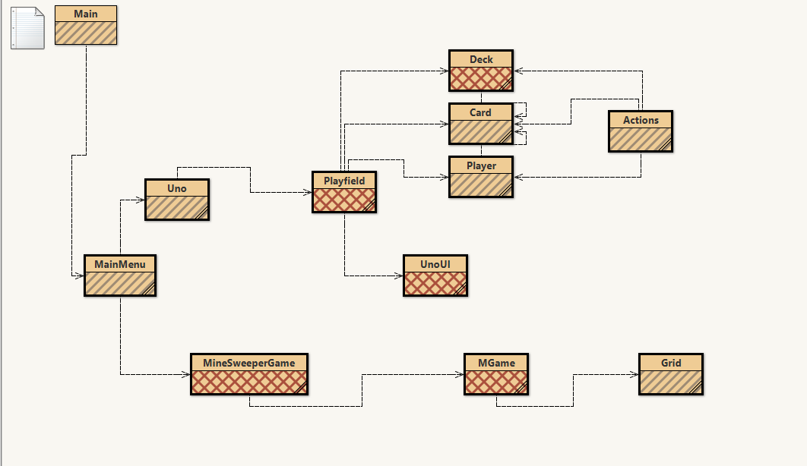

# CSA-Calculator

**Standard SDK:** adopt-openj9-15

**Team Goals Week 8:**

Fix our README to be more consice; reference actual code; add TODO:
establish an overall theme for the project; minilab; we are thinking about a game from each decade
make sure we have no rubber chickens. Siddhant, Sean, and Kevin are working on UNO, Jacob and Aditya on Minesweeper.

**Individual Assignments Week 8:**

Sean: Fix Readme; work on the view of UNO game

Kevin: Fix Readme; work on control of UNO game

Siddhant: Fix Readme; work on view/model of UNO game

Jacob: Fix Readme; work on control of MineSweeper

Aditya: Fix Readme; work on view/model of MineSweeper

**Week 8 Progress Check**

Name    |Project | Goals |  Grade |  Reflection
-------------------------------------------
Kevin   |        |       |        |
Hu
                          
--------------------------------------------
Sean    |        |       |        |
Tran
        
---------------------------------------------
Siddhant|        |       |        |
Ranka

---------------------------------------------

----------------------------------------------

-----------------------------------------------
                
       

**How to run our code:**
- Our Project Standard SDK is adopt-openj9-15
- We have sent the link to our [Github project](https://github.com/keviin0/CSA-Portfolio-GroceryStoreSim)
- When pulling our code, we have a number of games. The two games from this week are UNO and Minesweeper
- Each of these should run individually and the main code should run.

**Week 7 Progress Check**

- Kevin

This week I focused one building a skeleton of MVC which was a big learning target for this week. This can be seen in how I structure my contributions which distinctly separated functional code from any code dealing with UI. This will help me in the long term when working between the UI and functional code.
Contributions:
Anime.java
APIRequest.java

- Sean

 This week my goal was to mainly work on [Thai 21](https://github.com/keviin0/CSA-Portfolio-GroceryStoreSim/blob/main/src/ui/Thai21.java) and logistics. I was able to accomplish to goal. I made sure our group was using a standard IDE and a standard SDK (adopt-openj9-15). My Contribution includes adding Thai21 into [MainMenu](https://github.com/keviin0/CSA-Portfolio-GroceryStoreSim/blob/main/src/util/MainMenu.java#L97-L102), added [Thai21.java](https://github.com/keviin0/CSA-Portfolio-GroceryStoreSim/blob/main/src/ui/Thai21.java) and [Thai21.form](https://github.com/keviin0/CSA-Portfolio-GroceryStoreSim/blob/main/src/ui/Thai21.form). My Thai21 game is functional and can be played. My major merge onto the main branch is from this check-in SHA1 ID: commit 09ccf44345e91fe7351903ca5733577aed5905c6
  
 Self Grade: 5/5 

- Siddhant

I believe that I should get a 5/5 on my self-grade. I spent extra time outside of class searching for specific information for my code outside the resources provided to us in class, which included me going to the library to get a book on Java. I had learned from my last project that I should research the types of syntax and concepts I need and to plan out my code before just writing code and trying to learn along the way. I was able to overcome many issues on Intellij. Initially, I could not even commit my changes to my code. One time, an attempted commit ended up deleting my entire code. However, that may have been a good thing because I realized I could find a more efficient method to create my card deck for my War Card Game. Eventually, with the help of my team, I was able to create and push my code properly. However, when it came to creating a button that would appear on the main menu screen for the actual running of this project, I used the same style of text to create a button my team did, and I tried altering many parts of my code, but a button on the main menu screen still does not appear and IntelliJ pushed a certain part of my code in the wrong place in github. I commented on my original code and commit to show what my intended code was supposed to be. This is an issue I plan on resolving this weekend and in the beginning of next week. Otherwise, I believe I most likely created a functioning card deck, but I commented out my final changes because I wasn't entirely sure if they were correct, and I did not want to create any "rubber chickens" in the code that would hurt my group.  

- Aditya

For my self grade, I believe that I should get a 5/5. I set a goal for myself to finish a TicTacToe mini game by the end of the week, which I accomplished. It was no easy task, though. Since I'm still learning IntelliJ, I had to spend a lot of time playing with the IDE to get it to work with my code. I have also never used JPanel in Java, so I had to climb a steep learning curve for that as well. I faced many syntactical, as well as logical errors, but I was able to problem solve to get to my end result. I watched many videos, and I also used a Java book that I found at home to teach myself these concepts. Additionally, this week, I changed my method of typing my code for these projects; instead of diving straight into it, I decided to plan out my code first, so that I could conduct any research that would be necessary in order to successfully complete my code. This method was a lot more efficient than my method for the previous weeks. One problem that I haven't solved yet is getting my mini game to appear on the Main Menu, which a few other people in our group are having. We will look into this problem over the weekend as well as the beginning of next week. Overall, I think I contributed quite a lot to the team, since I made a whole mini game for our project.
My Contributions: TicTacToe.java, MVC Calculator 2 Design
- Jacob
For self grade, I believe that I should get a 5/5. I set a goal to review Model View Controller and I'm still learning IntelliJ. I dealt with many syntactical and logical errors along the way, but I believe that I've made significant progress. I've been reviewing how Model View Controller works and I've set up checklists to mark my progress and to set goals for myself. I'm also working on the War Card game. I've learned that the most efficient method is to first create a flow chart of the logic and what I need to achieve. This flowchart will help me when dealing with logical issues and it should help me in completing the mini game. I also had a problem in making my mini game appear in the main menu. I've set the goal for myself to finish the mini game over the weekend. 
--------Explanation for Each Lab:

- Calculator UI

Calculator UI is an advanced version of the sample calculator. The Calculator includes the standard adding, subtracting, multiply, and divide. The calculator also has a unique a hexadecimal converter. 

- Thai21

Thai21 is a mathematical game of strategy in which two players take turns removing flags from a pile. On each turn, a player must remove one, two, or three flags. They must remove at least one flag. The winner of the game is the one who takes the last flag(s) on their turn. The user always goes first in the game. The user always goes first because this is a discrete math game in which a single strategy can win the game everytime and can give the computer an unfair advantage.

The game is run by pressing the start button. After the game has started, the user and computer takes turns. The user may select one, two, or three by pressing the corresponding flag buttons. The corresponding buttons are only enabled if there are enough remaining flags. For example, if there are only 2 flags left then the button for 3 flags is disabled. After the user's turn, it is the computer's turn. The computer will take at random, one, two, or three flags if there are more than three flags left. If there are less than three flags left on the computer turn, it will win. The computer's pick is displayed in a pop-up on the top left corner. When the last flag has been picked, a notification for the winner of the game is displayed.
The game can restart by pressing the start button again.

- TicTacToe

This UI TicTacToe game simulates an actual game of TicTacToe. The game requires that there are two people, obviously, so there are two different symbols that the players can choose from, either a X or an O. The player who chooses X is told that they are first; in order to choose a spot to place their symbol, the player uses their mouse to click near the center of one of the nine boxes. Their spot has been selected, so now it's time for the second player to select a spot, following the same procedure with the mouse that the first player did. This process continues until a player wins, which is when they place three of their symbols in a row, column, or diagonal. The UI will notify the players when one of them has won. If neither player wins, the UI will notify the players that it's a draw.

- WarCardGame

The UI WarCardGame code is the beginning of a code that is meant to simulate a game of the card game war. So far, a potential card deck has been created to store a typical set of cards. Later on, the order of the cards will be randomized and half the cards will be dealt to the player and the other half to the computer. When prompted, the player will draw a random card, which will signal to the computer to draw a random card. There will then be a set of conditions stating that if the player has a higher card than the computer, the player will get a certain number of points. This works the same way if the computer has the higher card. This process will continue until the both the player and the computer have run of cards. At this point, the program will print the final scores of the player and the computer. It will then read the final scores of the player and the computer, do a comparison to decide which score is higher, and then declare the winner.

MVC BlueJ Model (as of 10/23/2020):

--------MVC CALCULATOR DESIGN FOR PAIR/TRIO OF ADITYA, JACOB

Three Classes
- Model
- View
- Controller

The Model class is responsible for the calculations.
The View class draws the calculator, as well as the display.
The Controller class has two functions. One function is to pass the button clicks to the View class. The second function is to get the display value from the Model class so that it can be passed to the View class.

There will be a Button interface, where the Button instance includes:
- ID Numbers
- A Name
- Function

The Controller class would build a collection of Buttons, while the View class, as well as the Model class would use the buttons.

So, after this, the controller would:
- Pass Clicks to View
- Return Button ID to Model
- Get the display value from Model to pass to View

