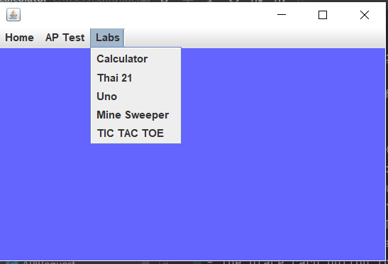

# CSA-Calculator

**Standard SDK:** adopt-openj9-15

**Project Theme:** Games from the Decades

**How to run our code:**
- Our Project Standard SDK is adopt-openj9-15
- We have sent the link to our [Github project](https://github.com/keviin0/CSA-Portfolio-GroceryStoreSim)
- When pulling our code, we have a number of games. The two games from this week are UNO and Minesweeper
- Each of these should run individually and the main code should run.
- The Home Button and AP Test Button do not work. Only the Labs Button Works. The two games from this weeek are UNO and Minesweep.
- Siddhant, Kevin, and Sean worked on UNO and Jacob and Aditya worked on Minesweeper.
- The place card button for the UNO game does not work and only 1 card can be drawn for the UNO game.
- Note for the instructions: We added extra instructions so we hopefully will not waste any of your time for you trying to figure out how to run our code.

**Team Goals Week 8:**
* make readme more concise

* reference actual code in progress check

* add TODO: to help keep collaboration organized

* establish overall theme for project 

* try to have no rubber chickens

**Pair / Trio breakdowns:**

Sean / Kevin / Siddhant : UNO game
 
Aditya / Jacob : MineSweeper

**Individual Assignments Week 8:**

Sean: Fix Readme; work on the view of UNO game

Kevin: Fix Readme; work on control of UNO game

Siddhant: Fix Readme; work on view/model of UNO game

Jacob: Fix Readme; work on control of MineSweeper

Aditya: Fix Readme; work on view/model of MineSweeper

**Week 8 Progress Check**

| *Contributor's   Name* | *Self   Grade (out   of 20)* | Reasoning | Scrum Master   Grade (out   of 5)
|---|:---:|---|---|
|Kevin Hu | 19/20 | Completed model and control segments of Uno with model found in [Actions.java](./src/util/Actions.java) and control in [Playfield.java](./src/util/Playfield.java). Created bridge between View and Model/Control with performAction() method in [UnoUI.java](./src/ui/UnoUI). All other work in helper files: [Card.java](./src/util/Card.java), [Deck.java](./src/util/Deck.java), [Player.java](./src/util/Player.java). Still need to add special card functionality in Actions.java for full game functionality.  | 5/5 Developed entirety of model/control for Uno |
|Sean Tran   | 19/20 | I was able to accomplish my goal of fixing the [read.me](https://github.com/keviin0/CSA-Portfolio-GroceryStoreSim/blob/main/README.md) to be more concise and easier to read. I added menu buttons for my team on the [MainMenuUI](https://github.com/keviin0/CSA-Portfolio-GroceryStoreSim/blob/main/src/util/MainMenu.java#L87-L113) so we can run all games from it. My goal/assignment was to work on the view of the Uno game this week. I designed the [interface](https://github.com/keviin0/CSA-Portfolio-GroceryStoreSim/blob/main/src/ui/UnoUI.form). I collaborated with Kevin on the View Controller components such as updating [Card Deck]( https://github.com/keviin0/CSA-Portfolio-GroceryStoreSim/blob/main/src/util/Deck.java#L17-L20). I implemented the [UNO UI](https://github.com/keviin0/CSA-Portfolio-GroceryStoreSim/blob/main/src/ui/UnoUI.java). Updated notes to [Journal](https://docs.google.com/document/d/1Eq7m4VV92lnr9jNV4NAeMXk2w12HXQcJsRfXPjjd0Jk/edit?usp=sharing). | 5/5 Completed entirety of view for Uno|
|  Aditya Surapaneni | 19/20 | I achieved my goals for this week. I helped with the creation of the Minesweeper mini game by working on the View and Model of the program, which included the creation of Grid.java, Square.java, and a few portions of MGame.java. I also updated the README so that it's more concise. 1. [Grid.java:](https://github.com/keviin0/CSA-Portfolio-GroceryStoreSim/blob/main/src/util/Grid.java) 2. [Square.java:](https://github.com/keviin0/CSA-Portfolio-GroceryStoreSim/blob/main/src/util/Square.java) 3. [MGame.java:](https://github.com/keviin0/CSA-Portfolio-GroceryStoreSim/blob/main/src/util/MGame.java) | 5/5 contributed to functional minesweepeer |
|  Jacob Rozenkrants | 19/20 | I achieved my goals for this week. I wanted to understand MVC through more involvement. Aditya and I initially worked on an earlier version of the MineSweeper game, but we came to realize there were compatibility problems. This is the most recent version. I worked a bit on Square.Java but mostly prioritized MGame.Java. [Square.java:](https://github.com/keviin0/CSA-Portfolio-GroceryStoreSim/blob/main/src/util/Square.java) and [MGame.java:](https://github.com/keviin0/CSA-Portfolio-GroceryStoreSim/blob/main/src/util/MGame.java) | 5/5 contributed to functional minesweeper  | 
|Siddhant Ranka   | 18/20 | I made significant contributions to the README. I added extra notes to my [Journal](https://docs.google.com/document/d/1Eq7m4VV92lnr9jNV4NAeMXk2w12HXQcJsRfXPjjd0Jk/edit). I fell behind on my goals for adding the view code for UNO. It was far more difficult than I anticipated to learn the necessary Java concepts. I attempted to create a button showing all the cards in the Deck. On Monday and Tuesday, I created my own card deck. Kevin's version was used instead, so I commented mine out. On my own, I managed to create a functional card deck and made some progress on [shuffling it](https://github.com/keviin0/CSA-Portfolio-GroceryStoreSim/commit/0939cbe3031c39a298ad15b24981f6041ccf5f47). Next Week, I would like to work on the card game itself since I am more familiar with the code needed for that. | 1/5 updated only the README |
|   |   |   |   |
                
--------Explanation for Each Lab:

- Calculator UI

Calculator UI is an advanced version of the sample calculator. The Calculator includes the standard adding, subtracting, multiply, and divide. The calculator also has a unique a hexadecimal converter. 
- UNO
A computer simulation of the Card Game UNo
-Minsweeper
A Java simulation of the 1989 video game Minesweeeper.

MVC BlueJ Model (as of 10/30/2020) no including Calculator:

--------MVC CALCULATOR DESIGN FOR PAIR/TRIO OF ADITYA, JACOB

Three Classes
- Model
- View
- Controller

The Model class is responsible for the calculations.
The View class draws the calculator, as well as the display.
The Controller class has two functions. One function is to pass the button clicks to the View class. The second function is to get the display value from the Model class so that it can be passed to the View class.

There will be a Button interface, where the Button instance includes:
- ID Numbers
- A Name
- Function

The Controller class would build a collection of Buttons, while the View class, as well as the Model class would use the buttons.

So, after this, the controller would:
- Pass Clicks to View
- Return Button ID to Model
- Get the display value from Model to pass to View

